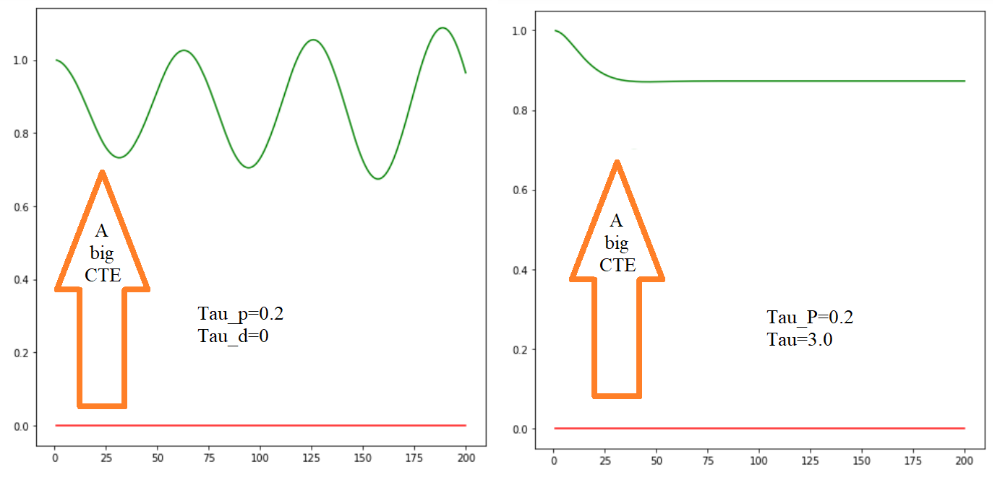
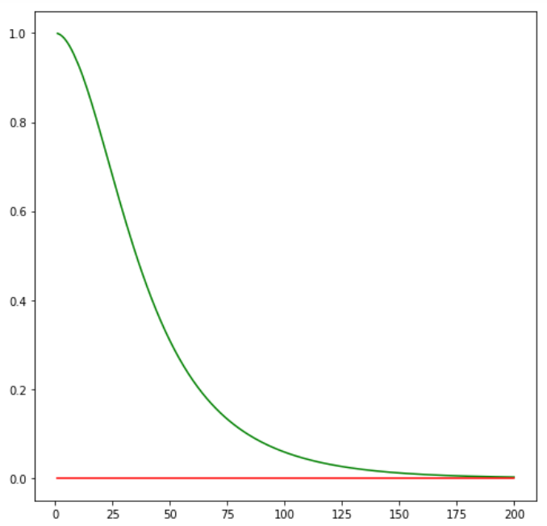

# Introduction

Control is how we use the steering, throttle and breaks to move a car where we want it to go. Control is a trickier problem than it might seem when human turns through an intersection, we use our intuition and experience to determine how hard to steer and when to accelerate and whether we ever need to step on the brakes. Teaching a computer how to do this is hard.
Control algorithms are often called controllers and one of the most common and fundamental controllers is the PID controller. In this lesson, we will learn how to implement [a PID controller in python](https://github.com/A2Amir/PID-Control/blob/master/Python/PID.ipynb) then we will dive into the Udacity simulator to implement a PID controller in C++.

# PID Control

PID control is a vast field in control and many classes can be taught about this one subject matter. I'll give you the very basics so that you can be able to drive a car around and the Google car uses a version of this exact same controller but much more tuned.

Below is presented the problem. Consider the car in the image below with a steerable front axle and 2 non-steerable wheels in the back. Say we wished this car to drive along the black line (the so-called reference trajectory) and assume the car has a fixed forward velocity but you have the ability to set the steering angle of the car. How would you do this? 

1.	You could set the steering angle in proportion to what is known as the "Cross Track Error", which is the lateral distance between the vehicle and the so-called reference trajectory.
2.	You could use a steering constant.
3.	You could use random steering commands

  
 

The best suited to control the car is the steering angle in proportion to the Cross Track Error, As you get closer to trajectory, your steering will be slower and slower and clearly the other two answers are really bad.

  
 

You will reach the trajectory, which means the larger the error, the more you're willing to turn towards the reference trajectory.

## Proportional Control

What you just learned above is called a "P-controller" where P stands for proportional. Suppose you steer in proportion to the cross track error and your steering angle is proportional to the cross Track error by a factor Tau. What will happen to the car?

1.	It never quite reaches the reference trajectory?
2.	It overshoots?
3.	Either can happen?

  

 
The answer is, it actually overshoots. The problem is, no matter how small the Tau constant is, It will eventually turn its wheels quite a bit towards it's trajectory and moves towards the trajectory more and more(green lines) when it hits the trajectory, it's wheels will be straight but the robot itself will still be oriented a little bit downwards, so it's forced to overshoot.

  

What it applied to a car, a P-controller will act like below.  It will slightly overshoot, and that could be okay. The overshooting is very small but it will never really converge. It will be what's called "marginally stable" or often just "stable" in the literature.

  

## Implement P Controller

In the following section I will implement a P controller. In  the code I've prepared there is a class robot and It has an "init". You can set the position of the robot using the function "set" and there is a move command.

Below is what I envision to happen, the robot is initially off the x axis by 1 I want it to drive along the x axis and the y value is the same as the cross track error. By turning, inversely proportional to the y value using a parameter Tau that sets the response strength of the proportional control . I want the robot to turn towards the x axis, drive in that direction, overshoot, turn around, and drive back

  

To do this, simulate the world for a 200 steps, and use a proportionality term that sets my steering angle (alpha) in proportion to the cross track error y. the image blow  presents the execution of the code.

  

When you change the Tau (the control parameter) from 0.1 to 0.3 you can see, it oscillates faster and we compensate much more.

  

## PD Controller

The basic next question is is there a way to void the overshoot?  It would be nice if we could do this, because driving in an oscillating car is no fun. The trick is called "PD-control." 

In PD-control the steering alpha is no just related to the cross track error by virtue of the gain parameter tau_p( called previously tau) but also to the temporal derivative of the cross track error, what this means is that when the car has turned enough to reduce the cross track error, it won't just go shooting for the x axis. As seen below, by assuming appropriate settings of the differential gain tau_d versus the proportional gain tau_p, it gracefully approaches the target trajectory.

  

How do you compute the temporal derivative of the cross track error? This can be computed by the cross track error at time t minus the crosst rack error at time t minus 1 divided by the time span between t and t minus 1. In our code, we assume delta t equals 1, so we can omit this.

  

We now control not just in proportion to the error itself but also to the difference of the error using a second constant tau d. After implementing and running the code we can see from the below image the PD controller performs much better when it comes to compare with the P Controller.

  

## systematic bias
For this section I am going to talk about a problem that often occurs in robotics called a "systematic bias." When you ordered your car, you believed the front wheels were 100% aligned, but your mechanic made a mistake, and he aligned the wheels a little bit at an angle. Now, for people that isn't a big concern. When we notice this problem, we just steer a little bit stronger. 

To solve this problem, I'm now adding a line that sets the steering drift to be 10 degrees using set_steering_drift command:

      robot.set_steering_drift(10.0/180.0*np.pi)

As you can see below in the image on the left when I run the proportional controller with parameter 0.2 and the differential controller set to 0, it causes a big cross track error (CTE) and when I change  the differential controller to 3(the right image), it makes no difference.

  

As tried out, change the differential controller, it makes no difference because the y error is still large.To solve this problem, we need to add another piece to our equation, which will be explained in the next section.

## PID implementation

As seen above, If you drive a car and your normal steering mode leads you to a trajectory far away from the goal and over a long period of time you can't get closer (see  above the  image on the right). you start steering more and more and the more time goes to the right to compensate the bias.
As a result, when you drive you steer the car this way (the green arrow above). To drive like the green arrow, you need a sustained situation of large error. That is measured by the integral or the sum of the cross track errors over time.

  

To make a new controller (see the image below)where steering is proportional to the cross track errors as before and It's equally proportional to the differential of the cross track error, but now it's also proportional to what's called the integral or the sum of all the cross track errors you ever observed.

  

Below is presented the result of running the implemented the new controller:

  

Notice: the purpose of the integral term is to compensate for biases and the current robot has no bias. Now, the big question is how we can find good control gains where control gains are these parameters tau_p, tau_d and tau_i. The answer is to called "twiddle." Some people call it "coordinate ascent" to make it a little more sophisticated.

## Twiddle

In Twiddle, we are trying to optimize for a set of parameters. To do so, 

1. Our function run()  (See the code) must return a goodness. This goodness value might be the average cross track error. 
2. Say I wanted to implement Twiddle to minimize the average cross track error. The output of the run function depends on the three parameters.

To implement Twiddle, we 

1. build a parameter vector ( named p) of our 3-target parameters, and initialize it with zero.
2. build a vector of potential changes (named dp) that you want to probe and initialize them for now with 1.
3. Then you can run our command run( ) with our parameters and whatever it outputs is our best error so far.

          p = [0, 0, 0]
          dp = [1, 1, 1]
          robot = make_robot()
          x_trajectory, y_trajectory, best_err = run(robot, p)
          
      Now we wish to modify p as to make the error smaller. That is where Twiddle comes in.

4.	We sequentially go through these parameters.

      4.1. First we tried to increase p by our probing value and compute a new error for this new modified p.
      
        for i in range(len(p)):
            p[i] += dp[i]
            robot = make_robot()
            x_trajectory, y_trajectory, err = run(robot, p)

      4.2. If this new error is better than our best error, then we do two things.
           First, we set best_err to err and we even modify our dp to a slightly larger value by multiplying it with 1.1
           
            if err < best_err:
                best_err = err
                dp[i] *= 1.1
                
      4.3.	Otherwise, we try the other way.
            We subtract dp from p and we have to do it twice because we added it before and by creating a new robot we do the same thing again. We check whether the error is better than our best error, we retain it, and we multiply dp by 1.1.
            
            else:
                p[i] -= 2 * dp[i]
                robot = make_robot()
                x_trajectory, y_trajectory, err = run(robot, p)

                if err < best_err:
                    best_err = err
                    dp[i] *= 1.1
                  
     
      4.4. But if both of those (two if before) fail, we set p[ i ] back to the original value, and we decrease our probing by multiplying it with 0.9.
      
                 else:
                    p[i] += dp[i]
                    dp[i] *= 0.9
      
5. We do this entire thing so long as the sum of the dp's is larger than the threshold(for example 0.00001).

That's the core of Twiddle and what it really does is for each coordinate in isolation it moves our parameter down a little bit by potential changes(dp), If it then finds a better solution, it retains it, and it even increments the probing interval. If it fails to find a better solution, it goes back to the original and decreases our probing interval.

As seen below after optimising the parameters with the twiddle algorithm, the PID controller outshines PD controller! Also, with twiddle the PID controller converges faster but we overshoot drastically at first so it's a tradeoff. 

  

 Below presented all Controllers:

  

