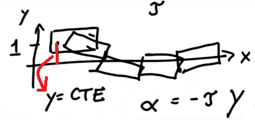

# Introduction

Control is how we use the steering, throttle and breaks to move a car where we want it to go. Control is a trickier problem than it might seem when human turns through an intersection, we use our intuition and experience to determine how hard to steer and when to accelerate and whether we ever need to step on the brakes. Teaching a computer how to do this is hard.
Control algorithms are often called controllers and one of the most common and fundamental controllers is the PID controller. In this lesson, we will learn how to implement a PID controller in Python then we will dive into the Udacity simulator to implement a PID controller in C++.

# PID Control

PID control is a vast field in control and many classes can be taught about this one subject matter. I'll give you the very basics so that you can be able to drive a car around and the Google car uses a version of this exact same controller but much more tuned.

Below is presented the problem. Consider the car in the image below with a steerable front axle and 2 non-steerable wheels in the back. Say we wished this car to drive along the black line (the so-called reference trajectory) and assume the car has a fixed forward velocity but you have the ability to set the steering angle of the car. How would you do this? 

1.	You could set the steering angle in proportion to what is known as the "Cross Track Error", which is the lateral distance between the vehicle and the so-called reference trajectory.
2.	You could use a steering constant.
3.	You could use random steering commands

  
 

The best suited to control the car is the steering angle in proportion to the Cross Track Error, As you get closer to trajectory, your steering will be slower and slower and clearly the other two answers are really bad.

  
 

You will reach the trajectory, which means the larger the error, the more you're willing to turn towards the reference trajectory.

## Proportional Control

What you just learned above is called a "P-controller" where P stands for proportional. Suppose you steer in proportion to the cross track error and your steering angle is proportional to the cross Track error by a factor Tau. What will happen to the car?

1.	It never quite reaches the reference trajectory?
2.	It overshoots?
3.	Either can happen?

  

The answer is, it actually overshoots. The problem is, no matter how small the Tau constant is, It will eventually turn its wheels quite a bit towards it's trajectory and moves towards the trajectory more and more(green lines) when it hits the trajectory, it's wheels will be straight but the robot itself will still be oriented a little bit downwards, so it's forced to overshoot.

  

What it applied to a car, a P-controller will act like below.  It will slightly overshoot, and that could be okay. The overshooting is very small but it will never really converge. It will be what's called "marginally stable" or often just "stable" in the literature.

  

## Implement P Controller

In the following section I will implement a P controller. In  the code I've prepared there is a class robot and It has an "init". You can set the position of the robot using the function "set" and there is a move command.

Below is what I envision to happen, the robot is initially off the x axis by 1 I want it to drive along the x axis and the y value is the same as the cross track error. By turning, inversely proportional to the y value using a parameter Tau that sets the response strength of the proportional control . I want the robot to turn towards the x axis, drive in that direction, overshoot, turn around, and drive back

  

To do this, simulate the world for a 200 steps, and use a proportionality term that sets my steering angle (alpha) in proportion to the cross track error y. the image blow  presents the execution of the code.

  

When you change the Tau (the control parameter) from 0.1 to 0.3 you can see, it oscillates faster.

  

